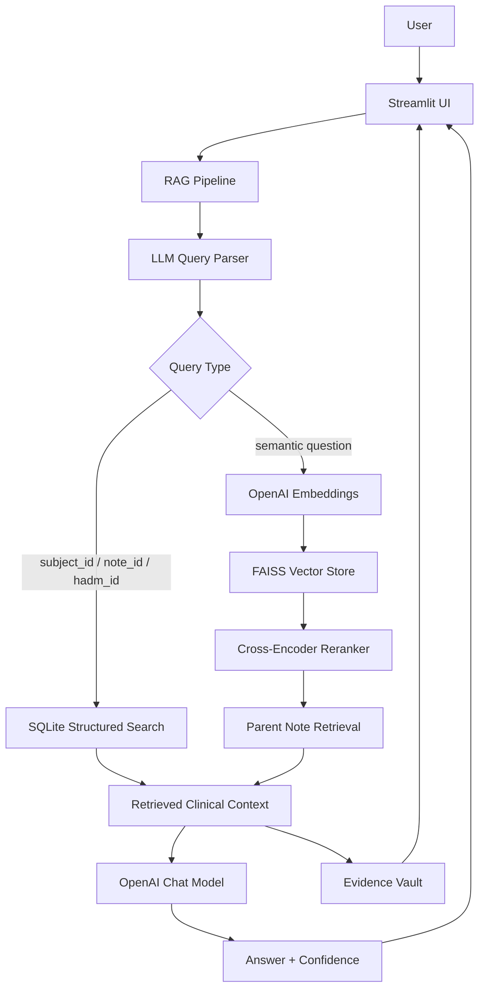

# Clinical Note Intelligence with RAG

**Helping clinicians find relevant answers faster from unstructured clinical notes**

> This project repository is created in partial fulfillment of the requirements
> for the Big Data Analytics course offered by the Master of Science in Business
> Analytics program at the Carlson School of Management, University of Minnesota.

---

## Executive Summary

Clinical notes are stored as long, fragmented, and inconsistent unstructured text, making it difficult for clinicians and analysts to search across patient histories or answer clinical questions quickly.

This project implements a Retrieval-Augmented Generation (RAG) system that combines structured search, semantic retrieval, reranking, and grounded LLM generation. The Streamlit interface supports patient-level chart review and population-level clinical question answering by retrieving relevant MIMIC-IV discharge notes, synthesizing answers from the retrieved evidence, and displaying supporting notes through an Evidence Vault.

The system uses a FAISS vector store for semantic similarity search, SQLite for direct patient/note/admission lookup, OpenAI embedding and chat models for retrieval and generation, and RAGAS-based evaluation to assess answer quality.

---

## Use Cases

- **Patient-Level Analysis (Chart Review):** Retrieve and summarize a specific patient's clinical history using `subject_id`, `note_id`, or `hadm_id`.
- **Population-Level Insights (Scalable Analysis):** Search across clinical notes to identify recurring symptoms, diagnoses, treatments, and patterns across patient groups.
- **Evidence-Backed Question Answering:** Generate concise clinical answers constrained to retrieved notes, with RAGAS-based confidence indicators and supporting evidence shown in the UI.

---

## Key System Capabilities

- **Intent-Aware Routing:** Parses user queries and routes them to patient lookup, note lookup, visit lookup, or semantic retrieval.
- **Hybrid Retrieval:** Combines structured SQLite search with FAISS-based semantic search over chunked clinical notes.
- **Parent Note Context:** Retrieves full parent notes from top-ranked chunks to preserve clinical context before generation.
- **Grounded Generation:** Constrains LLM answers to retrieved clinical-note context, significantly reducing unsupported responses.
- **Reranking:** Uses a cross-encoder reranker to improve the relevance of retrieved chunks before generation.
- **Evidence Vault:** Displays retrieved supporting notes, metadata, scores, and note IDs in the Streamlit interface.
- **Evaluation Support:** Includes RAGAS evaluation notebooks, generated test sets, and summary result files.

---

## System Architecture



---

## Repository Structure

```text
.
├── app.py                         # Streamlit web application
├── requirements.txt               # Python dependencies
├── flier.pdf                      # Project summary flier
├── RAG_evaluation_dataset.xlsx    # Contains 13 manually curated clinical QA pairs used for Mode 1 RAGAS evaluation
├── rag_data_pipeline.ipynb        # Data exploration / processing notebook
├── ragas_evaluation.ipynb         # RAGAS evaluation notebook
├── evaluation_results/            # Evaluation outputs and summary files
├── storage/                       # Generated local SQLite DB, cache, and FAISS index artifacts
└── src/
    ├── agent.py                   # LangGraph-style RAG orchestration
    ├── cache.py                   # Query response cache
    ├── config.py                  # Environment and model configuration
    ├── csv_to_sqlite.py           # CSV-to-SQLite loader for structured search
    ├── data_sources/
    │   └── csv_loader.py          # CSV document loader
    ├── demo_ragas.py              # Demo RAGAS score attachment
    ├── embeddings.py              # OpenAI embedding model setup
    ├── evaluator.py               # Retrieval and rerank quality checks
    ├── ingest.py                  # Data ingestion, chunking, and FAISS index build
    ├── llm.py                     # OpenAI chat model prompts and generation calls
    ├── logger.py                  # Pipeline logging utilities
    ├── parser.py                  # LLM-based query intent parser
    ├── pipeline.py                # End-to-end RAG pipeline entry point
    ├── reranker.py                # Cross-encoder reranker
    ├── retriever.py               # FAISS retrieval logic
    ├── state.py                   # Pipeline state schema
    ├── structured_search.py       # subject_id, note_id, and hadm_id search
    └── vectorstore.py             # FAISS vector store load/save logic
```

---

## Dataset

- **MIMIC-IV 3.1** clinical data and **MIMIC-IV Note 2.2** discharge notes
- `discharge.csv`, joinable to admissions data using `hadm_id`
- Chunk-level metadata includes `note_id`, `subject_id`, `hadm_id`, and source fields
- `RAG_evaluation_dataset.xlsx` contains 13 manually curated clinical QA pairs used for Mode 1 RAGAS evaluation
- Large raw and processed data files are stored outside the repository and should be accessed through the approved course or team storage location

### Data Access Notice

MIMIC-IV is not publicly downloadable without authorization. Users must request credentialed access through PhysioNet and complete the required human-subjects research training before accessing the dataset.

Dataset resource: [MIMIC-IV on PhysioNet](https://physionet.org/content/mimiciv/3.1/)

---

## Prerequisites

- Python 3.10+
- OpenAI API key
- Authorized MIMIC-IV / MIMIC-IV Note access through PhysioNet

---

## Setup & Installation

```bash
# 1. Clone the repository
git clone https://github.com/Eunggseo/big_data_team1.git
cd big_data_team1

# 2. Create and activate a virtual environment
python -m venv .venv
source .venv/bin/activate

# 3. Install dependencies
pip install -r requirements.txt

# 4. Configure environment variables
cp .env.example .env
# Edit .env with your OpenAI key and local data path

# 5. Build the SQLite notes database for structured search
python -m src.csv_to_sqlite

# 6. Build the FAISS vector index
python -c "from src.ingest import build_index; build_index()"

# 7. Run the Streamlit UI
streamlit run app.py
```

Example `.env` configuration:

```text
OPENAI_API_KEY=your_openai_key
OPENAI_CHAT_MODEL=gpt-4.1-mini
OPENAI_EMBED_MODEL=text-embedding-3-small
DATA_PATH=/path/to/discharge.csv
FAISS_INDEX_DIR=./storage/faiss_index
CACHE_DB_PATH=./storage/cache.sqlite
SQLITE_DB_PATH=./storage/notes.db
```


---

## Usage Examples

After launching the Streamlit app, users can ask questions such as:

```text
Summarize the clinical history for subject_id 12345.
```

```text
What treatments were documented for patients with sepsis?
```

```text
Summarize the hospitalization for hadm_id 27531779.
```

```text
What evidence is available about anemia management in patients with chronic kidney disease?
```

The application returns a grounded answer, a confidence label, and retrieved supporting notes in the Evidence Vault.

---

## Evaluation & Verification

The RAG pipeline was evaluated using RAGAS in two modes. Mode 1 uses `RAG_evaluation_dataset.xlsx`, a manually curated set of 13 clinical QA pairs created for initial evaluation. Mode 2 uses an auto-generated QA test set to provide broader evaluation coverage.

Both modes are evaluated using RAGAS metrics, including faithfulness, answer relevancy, context precision, and context recall. Evaluation artifacts and notebooks are included in the repository to support reproducibility and future improvement.

In addition to automated evaluation, the Streamlit interface displays retrieved supporting notes through the Evidence Vault so users can verify whether generated answers are grounded in the source documents.

---

## Limitations

- The system is a course project prototype and is not intended for clinical deployment.
- Generated answers depend on the quality and coverage of retrieved notes.
- RAG reduces hallucination risk but cannot eliminate it entirely.
- MIMIC-IV data is deidentified, but access and handling must still follow PhysioNet requirements.
- Local paths and large data artifacts may need to be adjusted for each user's environment.

---

## License

This repository is intended for academic use as part of the Big Data Analytics course project. If released publicly beyond the course context, the team should add an explicit open-source license such as MIT or Apache 2.0.

---

## Team Members (Team 1)

- [Ethan Armstrong](https://github.com/armst813)
- [Ziqi Cao](https://github.com/AnkitCao)
- [Ko-Jung Hsu](https://github.com/kojunghsu)
- [Cole Johnson](https://github.com/colej2325)
- [Mashhood Khan](https://github.com/mkhan-7)
- [Wenyu Zhong](https://github.com/Eunggseo)
